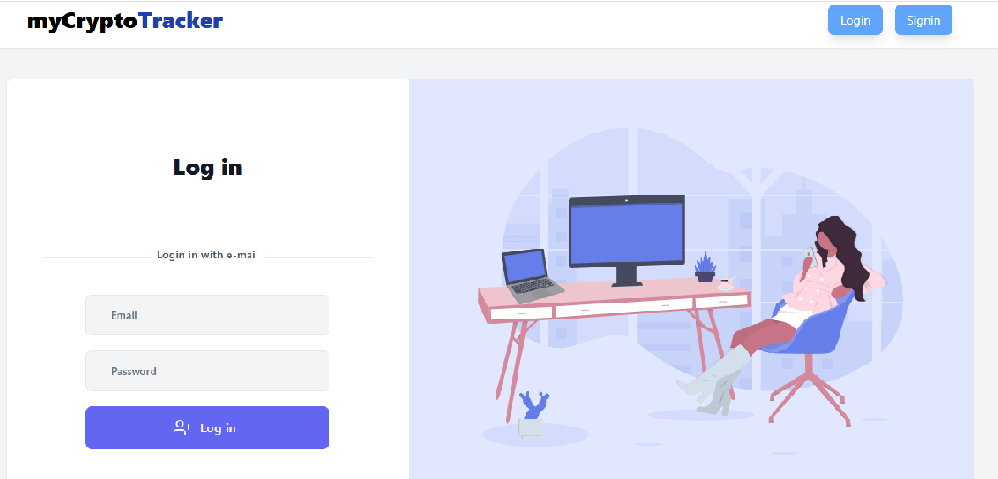

# CryptoTracker Project

## Overview

CryptoTracker is a cryptocurrency tracking application that allows users to track live cryptocurrency prices, market trends, and portfolio performance. This project leverages data from various cryptocurrency APIs and provides an intuitive user interface to interact with real-time data.

## Features

- Real-time cryptocurrency price tracking.
- View market trends for top cryptocurrencies.
- Portfolio management: Track your owned cryptocurrencies and their performance.
- User-friendly interface with interactive charts.
- Data updates every minute to ensure accurate market information.

## Tech Stack

- **Frontend**: React, Tailwind
- **Backend**: Node.js, Express.js
- **Database**: MongoDB 
- **API**: CoinGecko API 


## Installation

### Prerequisites

Before running the application locally, make sure you have the following installed:

- [Node.js](https://nodejs.org/en/)
- [MongoDB](https://www.mongodb.com/try/download/community) (or use MongoDB Atlas for cloud storage)
- [Git](https://git-scm.com/)

### IMAGES



### Clone the repository

```bash
git clone https://github.com/yourusername/cryptotracker.git
cd cryptotracker

